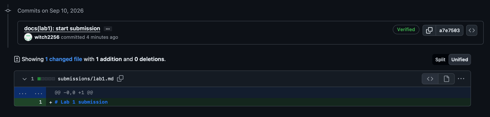
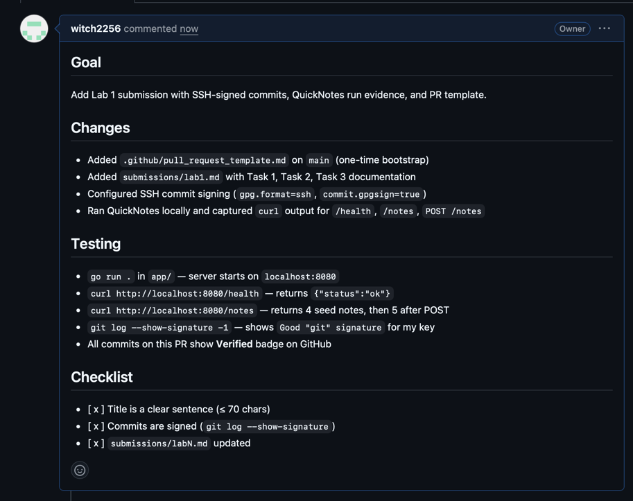
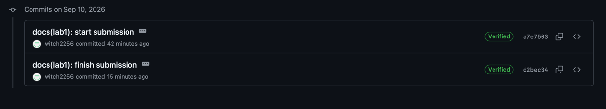

# Lab 1 submission

## Task 1

### Output of `curl -s http://localhost:8080/health | python3 -m json.tool`:

```
{
    "notes": 4,
    "status": "ok"
}
```

### Output of `curl -s http://localhost:8080/notes  | python3 -m json.tool`:

```
[
    {
        "id": 1,
        "title": "Welcome to QuickNotes",
        "body": "This is the project you'll containerize, deploy, monitor, and harden across all 10 labs.",
        "created_at": "2026-01-15T10:00:00Z"
    },
    {
        "id": 2,
        "title": "Read app/main.go first",
        "body": "Start by understanding the entry point \u2014 env vars, signal handling, graceful shutdown.",
        "created_at": "2026-01-15T10:05:00Z"
    },
    {
        "id": 3,
        "title": "DevOps mantra",
        "body": "If it hurts, do it more often.",
        "created_at": "2026-01-15T10:10:00Z"
    },
    {
        "id": 4,
        "title": "Endpoint cheat-sheet",
        "body": "GET /notes  GET /notes/{id}  POST /notes  DELETE /notes/{id}  GET /health  GET /metrics",
        "created_at": "2026-01-15T10:15:00Z"
    }
]
```

### Output of `curl -s -X POST http://localhost:8080/notes \
  -H 'Content-Type: application/json' \
  -d '{"title":"hello","body":"first POST"}' | python3 -m json.tool`:

```
{
    "id": 5,
    "title": "hello",
    "body": "first POST",
    "created_at": "2026-09-10T12:01:33.97452Z"
}
```

### Output of `git log --show-signature -1`:

```
commit a7e7503bf27f6980a80dfc34279c692264f54ebc (HEAD -> feature/lab1)
Good "git" signature for dudnyashka2006@gmail.com with ED25519 key SHA256:oEWn13cEcnUOUln62wZs8LycYNs3T9wO45UZALKw4Ro
Author: witch2256 <dudnyashka2006@gmail.com>
Date:   Thu Sep 10 18:29:53 2026 +0300

    docs(lab1): start submission
    
    Signed-off-by: witch2256 <dudnyashka2006@gmail.com>
```

### Screenshot of **Verified** commit:



### Why is it matter to sign commits?

Signed commits matter because they cryptographically prove the author's identity, unlike the plain Author field which anyone can forge by writing someone else's name and email. In March 2024, the `xz-utils` backdoor incident exploited exactly this gap: an attacker posing as a helpful maintainer under the nickname "Jia Tan" spent years building trust, eventually gained commit rights, and slipped a backdoor into `liblzma` that nearly shipped in Debian and Fedora. If the project had enforced mandatory commit signing like we configured in this lab, any commit made under a different identity would have shown up as "Unverified" — making the impersonation visible long before the malicious code reached any distribution.


## Task 2

Pull request created:



Every commit shows **Verified**: 



## Task 3

I starred course repository, starred the `simple-container-com/api` project — a promising open-source tool for container management, followed Professor and TAs, followed 4 classmates: @Salamer2, @AbdullohML, @amiranabiullina, @aniksel

### GitHub Community

**Why starring repositories matters in open source.**
Stars function as personal bookmarks for useful projects I want to revisit,
as a trust signal for other developers (a high star count shows community
validation), and as motivation for maintainers who gauge interest by them.
They also appear on my profile and form a public snapshot of my technical
interests.

**How following developers helps in team projects and professional growth.**
Following other developers gives me visibility into what they are building,
which tools they use, and what problems they care about — a natural way to
discover new ideas and stay current with the industry. On a team this helps
me quickly find the right person for a given problem, and professionally it
builds a network beyond the classroom that supports future collaborations
and job opportunities.


