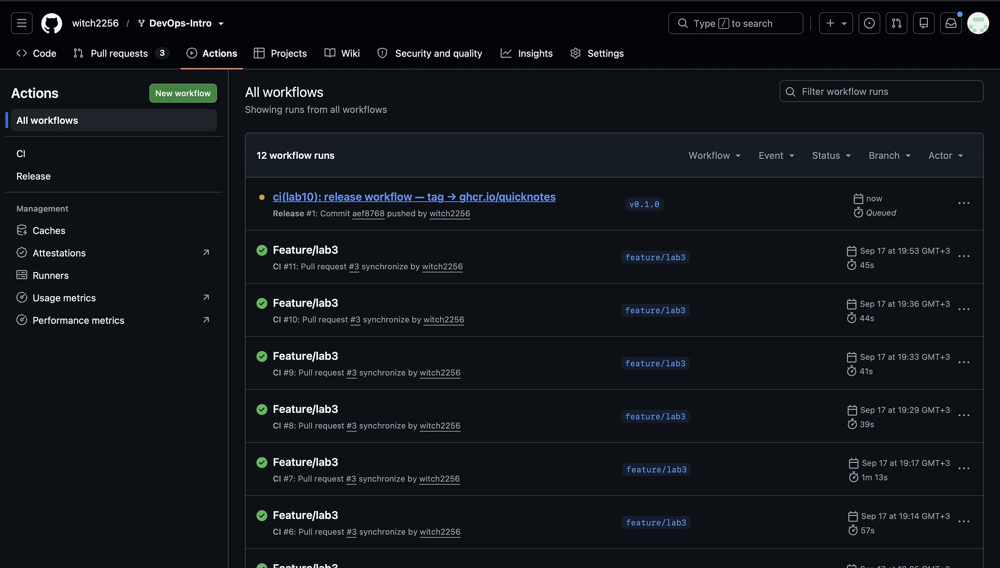
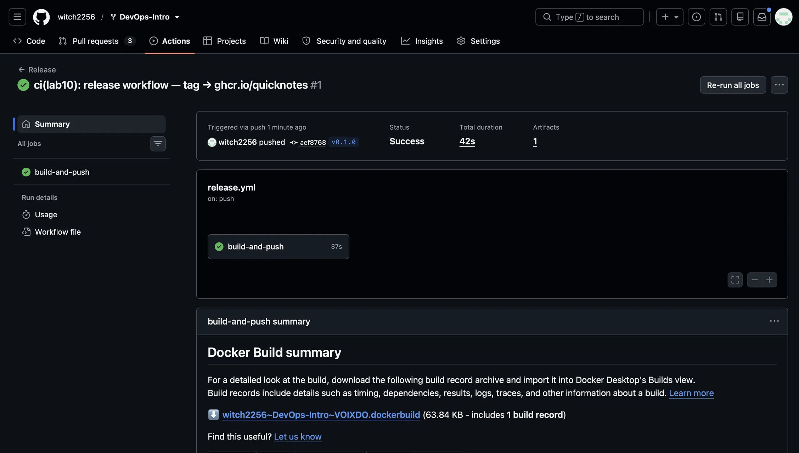
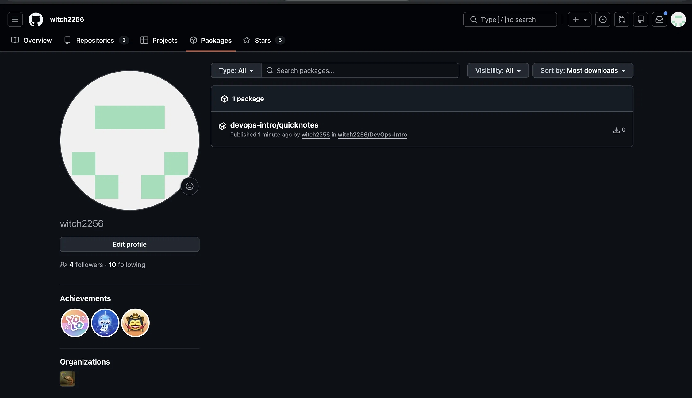
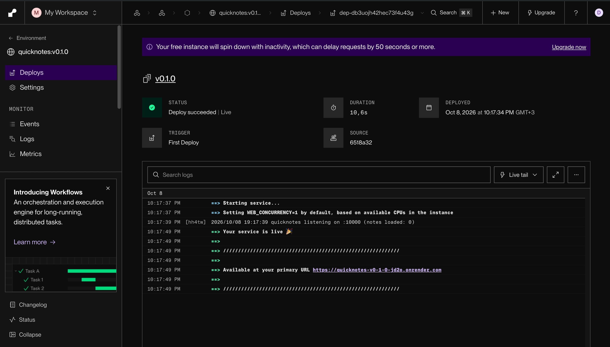

# Lab 10 submission

**Deploy target:** Option A — Render free web service.

## Task 1 — CI-Automated Push to ghcr.io

### 1.1 — Release workflow

`.github/workflows/release.yml`:

```yaml
name: Release

on:
  push:
    tags:
      - 'v*'

permissions:
  contents: read
  packages: write

jobs:
  build-and-push:
    runs-on: ubuntu-24.04
    steps:
      - name: Checkout
        uses: actions/checkout@11d5960a326750d5838078e36cf38b85af677262 # v4.4.0

      - name: Set up Buildx
        uses: docker/setup-buildx-action@8d2750c68a42422c14e847fe6c8ac0403b4cbd6f # v3.12.0

      - name: Log in to ghcr.io
        uses: docker/login-action@c94ce9fb468520275223c153574b00df6fe4bcc9 # v3.7.0
        with:
          registry: ghcr.io
          username: ${{ github.actor }}
          password: ${{ secrets.GITHUB_TOKEN }}

      - name: Build and push
        uses: docker/build-push-action@10e90e3645eae34f1e60eeb005ba3a3d33f178e8 # v6.19.2
        with:
          context: ./app
          platforms: linux/amd64
          push: true
          tags: |
            ghcr.io/witch2256/devops-intro/quicknotes:${{ github.ref_name }}
            ghcr.io/witch2256/devops-intro/quicknotes:latest
```

**Key decisions:**
- **`platforms: linux/amd64`** — the dev laptop is Apple Silicon (arm64), but Render runs amd64 containers. Building only for amd64 keeps the image small and avoids emulation.
- **`packages: write`** — the minimum scope for pushing to ghcr.io from the same repo.
- **All actions pinned by 40-char SHA**, carried forward from Lab 3.

### 1.4 — Release run

```bash
git tag -a -s v0.1.0 -m "Lab 10 release"
git push origin v0.1.0
```




- **CI run:** Release #1 — Success in 42s
- **Package published:** `ghcr.io/witch2256/devops-intro/quicknotes`


### 1.5 — Public pull verified

```bash
$ docker pull --platform linux/amd64 ghcr.io/witch2256/devops-intro/quicknotes:v0.1.0
...
Status: Downloaded newer image for ghcr.io/witch2256/devops-intro/quicknotes:v0.1.0

$ docker pull --platform linux/amd64 ghcr.io/witch2256/devops-intro/quicknotes:latest
Status: Downloaded newer image for ghcr.io/witch2256/devops-intro/quicknotes:latest
```

Both tags resolve to the same digest `sha256:2af69f73beb576a6691a94c9a3802842c18b3f12a0d65a93125664d7a567dec2`. No `docker login` needed — the package is public.

### 1.2 — Design questions

**a) OIDC vs `GITHUB_TOKEN` for pushing to ghcr.io**

For pushing to ghcr.io **from the same repository that owns the package**, `GITHUB_TOKEN` with `packages: write` is sufficient. The token is minted per-workflow-run, scoped to the repo, and expires with the job.

OIDC becomes necessary when the **build and the destination live in different trust domains** — pushing to AWS ECR, GCP Artifact Registry, or a different GitHub org's packages. In those cases you would otherwise need long-lived cloud credentials stored as secrets. OIDC lets the workflow exchange a short-lived GitHub-signed identity token for credentials from the target system, with no pre-shared secret.

What OIDC gives that `GITHUB_TOKEN` cannot: **a verifiable, externally-checkable identity statement** ("built by workflow X in repo Y at commit Z by actor A") that survives past the job's lifetime. `GITHUB_TOKEN` is scoped to the GitHub API and disappears when the job ends — nothing else can validate it.

**b) Why ship `:latest` alongside `:v0.1.0`?**

Lab 6 explained why `:latest` is a bad **deployment** tag: it's mutable, so two hosts that pull "the latest" at different times can run different images. That argument stands.

`:latest` is still shipped because it's a **developer convenience pointer**, not a deployment contract:

- `docker run ghcr.io/foo/bar:latest` in a README gets a new user up and running without them knowing which version is current.
- Renovate/Dependabot can watch `:latest` to notify consumers of new releases.
- Operators exploring an image can pull the newest without looking up tags.

The rule is: **deployments must pin immutable tags** (`:v0.1.0` or, better, `@sha256:...`), while `:latest` is a human-friendly pointer to the current release. Shipping both means no conflict — CI tags for humans and pins for production.

**c) `packages: write` only — principle and concrete attack it prevents**

Principle: **least privilege** — grant the smallest scope that still allows the job to do its work. The workflow needs exactly one capability.

- No `contents: write` — cannot push commits to `main`, cannot bypass branch protection, cannot rewrite history.
- No `pull-requests: write` — cannot comment on, merge, or close PRs.
- No `id-token: write` — cannot mint OIDC tokens to assume cloud identities.

**Concrete attack:** a supply-chain compromise of one of the pinned actions (a new CVE in `docker/build-push-action`, a malicious transitive dependency, or a hijacked `docker/login-action` tag that was supposed to be immutable). The compromised action runs inside the job and gets `GITHUB_TOKEN`.

- With `write: all` (the legacy default), the attacker could push code to `main`, edit CI workflows to exfiltrate other secrets on future runs, publish malicious releases, or merge a PR that does the same. Persistence + escalation.
- With `packages: write` only, the attacker's reach is bounded to writing to the one package this workflow was always allowed to write. No repo access, no PR access, no persistence in the code.

The narrow scope doesn't prevent the compromise; it **bounds the blast radius**. That's the point of least privilege — not "nothing bad happens" but "when something bad happens, the damage is contained".

## Task 2 — Deploy to Render

### 2.1 — Service configuration

- **Source:** Existing image — `ghcr.io/witch2256/devops-intro/quicknotes:v0.1.0`
- **Region:** Frankfurt
- **Instance type:** Free
- **Health check path:** `/health`
- **Public URL:** https://quicknotes-v0-1-0-jd2o.onrender.com

See `cloud/render.md` for the full configuration snapshot and the deploy-hook workflow step.

**Environment variables:**

| Key | Value | Why |
|---|---|---|
| `ADDR` | `:10000` | Render routes traffic to port `10000`. QuickNotes defaults to `:8080`; setting `ADDR=:10000` makes them agree without editing code. |
| `DATA_PATH` | `/tmp/notes.json` | Render Free has an ephemeral filesystem; `/data` isn't writable by the nonroot user. `/tmp` is writable and lives as long as the container. |
| `SEED_PATH` | `/tmp/seed.json` | No seed file shipped — starts with an empty store. |

**Deploy log evidence:**

```
10:17:37 PM  ==> Starting service...
10:17:37 PM  ==> Setting WEB_CONCURRENCY=1 by default, based on available CPUs in the instance
10:17:39 PM  [hh4tw] 2026/10/08 19:17:39 quicknotes listening on :10000 (notes loaded: 0)
10:17:49 PM  ==> Your service is live 🎉
10:17:49 PM  ==> Available at your primary URL https://quicknotes-v0-1-0-jd2o.onrender.com
```

Note: no `New primary port detected` message — the env var pre-empted the mismatch. Deploy completed in **10.6s**.

### 2.1 (cont.) — Public URL verified

```
$ curl -v https://quicknotes-v0-1-0-jd2o.onrender.com/health

* Host quicknotes-v0-1-0-jd2o.onrender.com:443 was resolved.
* IPv4: 216.24.57.16, 216.24.57.18
* SSL connection using TLSv1.3 / AEAD-CHACHA20-POLY1305-SHA256
* Server certificate: subject: CN=onrender.com
< HTTP/2 200
< content-type: application/json
...
{"notes":0,"status":"ok"}
```

Also verified:

```
$ curl -s https://quicknotes-v0-1-0-jd2o.onrender.com/notes
[]

$ curl -s https://quicknotes-v0-1-0-jd2o.onrender.com/metrics | head -5
# HELP quicknotes_notes_total Notes currently stored.
# TYPE quicknotes_notes_total gauge
quicknotes_notes_total 0
# HELP quicknotes_notes_created_total Notes created since process start.
# TYPE quicknotes_notes_created_total counter
```



### 2.2 — Cold vs warm latency

**Warm p50** (5 consecutive requests, immediately after wake):

```
$ for i in 1 2 3 4 5; do curl -w "%{time_total}\n" -o /dev/null -s https://quicknotes-v0-1-0-jd2o.onrender.com/health; done
0.613986
1.475027
0.622777
1.113042
0.805830

Median (p50) = 0.806 s
```

**Cold** (single request after 20+ min idle → container destroyed and recreated):

```
$ time curl -s -o /dev/null -w "HTTP %{http_code} | total: %{time_total}s\n" https://quicknotes-v0-1-0-jd2o.onrender.com/health
HTTP 200 | total: 12.823944s
```

**Cold/warm ratio:** ~16× slower on cold.

**Note persistence after spin-down:**

```
$ curl -X POST .../notes -d '{"title":"render-test","body":"survive spin-down?"}'
{ "id": 1, "title": "render-test", "body": "survive spin-down?", "created_at": "2026-10-08T19:20:08Z" }

$ curl .../notes (immediately after)
[{ "id": 1, "title": "render-test", ... }]

[20 minutes idle → container destroyed]

$ curl .../notes (after cold wake)
[]                                    ← note is GONE
```

The free tier has an **ephemeral filesystem**: whatever QuickNotes writes into `/tmp/notes.json` lives only as long as the container. When Render spins the container down, the writable layer is discarded. On the next request a fresh container is started from the immutable image, seeds itself from `SEED_PATH` (absent), and begins with an empty store.

**Sample size note:** only one cold measurement was collected, since each requires a 20-minute idle window. 12.8s is representative of the free-tier wake time for this service — additional runs would refine variance, not change the order of magnitude. Warm measurements were 5 consecutive requests.

### 2.4 — Design questions

**d) Render spin-down vs Cloud Run scale-to-zero**

Both models do "zero instances when idle, one on demand". The difference is what each platform **optimizes for**:

- **Cloud Run** is built for production microservices. Cold start is ~200ms–2s because Google pre-warms an instance pool, keeps images in a local cache near the region, and can hold minimum instances if paid for.
- **Render Free** is a developer tier with no SLO. The 10–15s wake includes discovering the request, scheduling a container on a shared host, pulling the image from ghcr.io if not cached, starting the process, and passing health checks. No pre-warm pool — free-tier users wake at the queue's discretion.

Same concept, different SLOs. Cloud Run's customers pay per request and expect production latency; Render Free is a convenience, so a slow wake is an acceptable trade for $0.

**e) Why does Render inject `PORT` instead of reading `EXPOSE`?**

`EXPOSE` in a Dockerfile is **documentation**, not a contract. Docker does not use it to route traffic — the image can EXPOSE `8080` and listen on `10000` at runtime; Docker won't complain. Platforms need a runtime contract, so they inject **`PORT`** into the container environment and route traffic to that port. Same image works on Render, Heroku, Cloud Run, Fly — the platform tells the app where to listen.

**What I set:** `ADDR=:10000` — QuickNotes' own env var, matching Render's chosen port. I did not set `PORT` because QuickNotes doesn't read it.

**Cost of the mismatch:** if `ADDR` and Render's port disagree, Render observes no traffic on the expected port, probes, finds the real one, and logs `New primary port detected ... Restarting deploy`. That costs **~45 extra seconds** of deploy time and one additional container lifecycle. Setting the env var upfront avoids it entirely.

**f) Existing image vs Render building from the repo**

**Existing image** (what I used):
- ✅ Reproducibility — the deployed artifact is exactly what CI built, pushed, and (in Lab 9) scanned by Trivy.
- ✅ Speed — Render skips the build. Deploy took **10.6s** vs 1–3 minutes from-repo.
- ✅ Consistency — local, Lab 6 compose, Lab 8 monitoring, and Render all run the same digest.
- ❌ CI must succeed before Render can deploy.

**Render building from repo:**
- ✅ Single source of truth (Render pulls from `main`, builds with the Dockerfile).
- ❌ Divergence risk: Render's build cache and BuildKit version differ from CI's — you get two pipelines producing "the same" artifact.
- ❌ Slower deploys.
- ❌ Lab 9's scan becomes meaningless for the deployed artifact — you scanned CI's build, not Render's.

For a "production rehearsal" workflow ("tag, build, push, sign, deploy"), **existing image is the right choice** — it enforces pipeline order and keeps the verified and deployed artifacts identical.

**Where did the note go?** It lived in `/tmp/notes.json` inside the container's writable layer. When Render spun the free service down, the container was **destroyed** — its writable filesystem with it. The next request starts a **fresh container from the image**, which has no `notes.json`; QuickNotes seeds from `SEED_PATH` (missing), starts empty. **The note is gone.** This is *ephemeral storage* — the single most important operational fact about free-tier PaaS. Persisting data across restarts requires a real backing store (Postgres, Redis, S3, or a paid persistent disk on Render). The image is immutable; state must live somewhere else.
