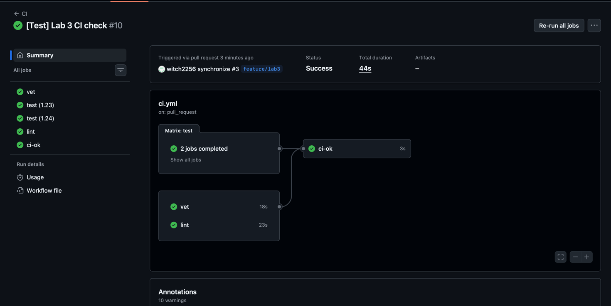
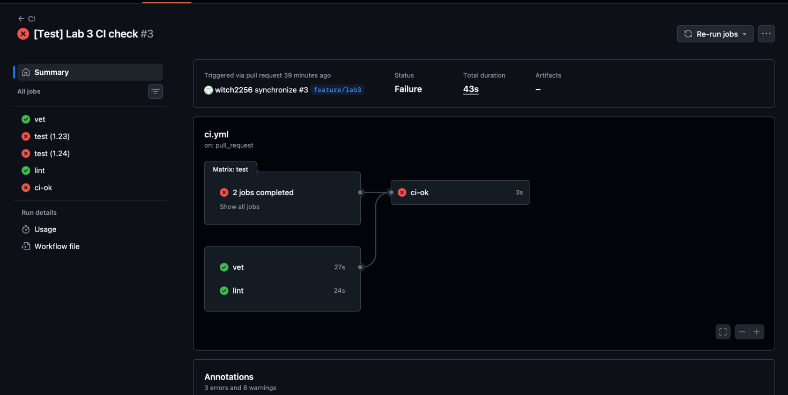
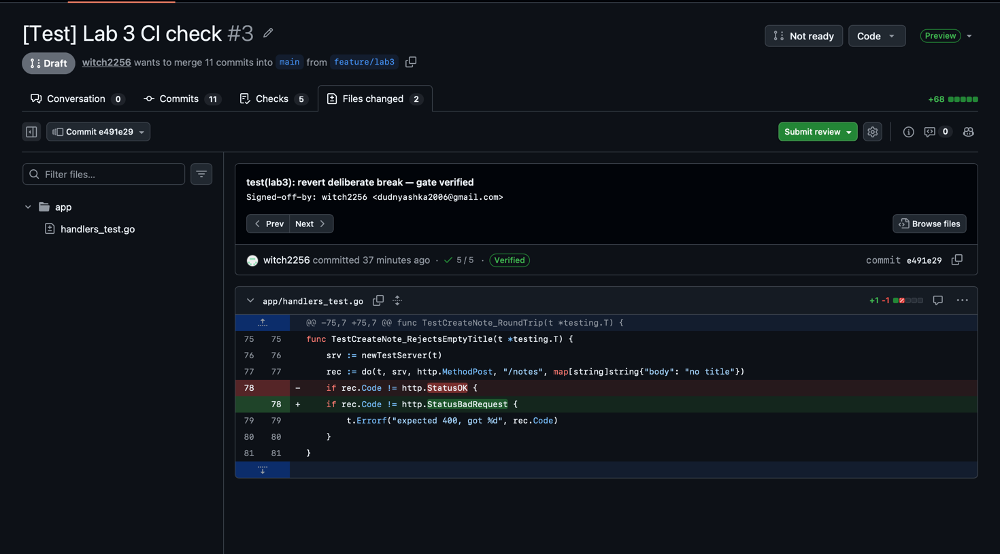
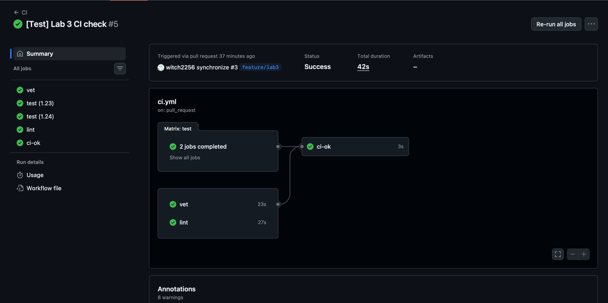
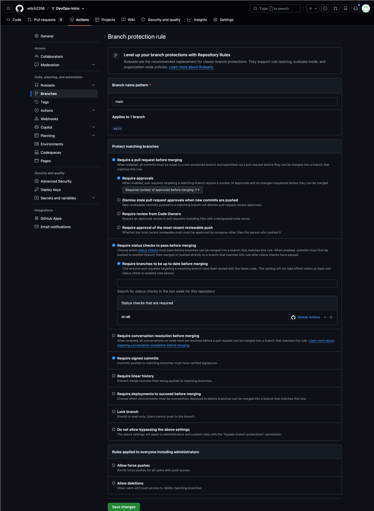
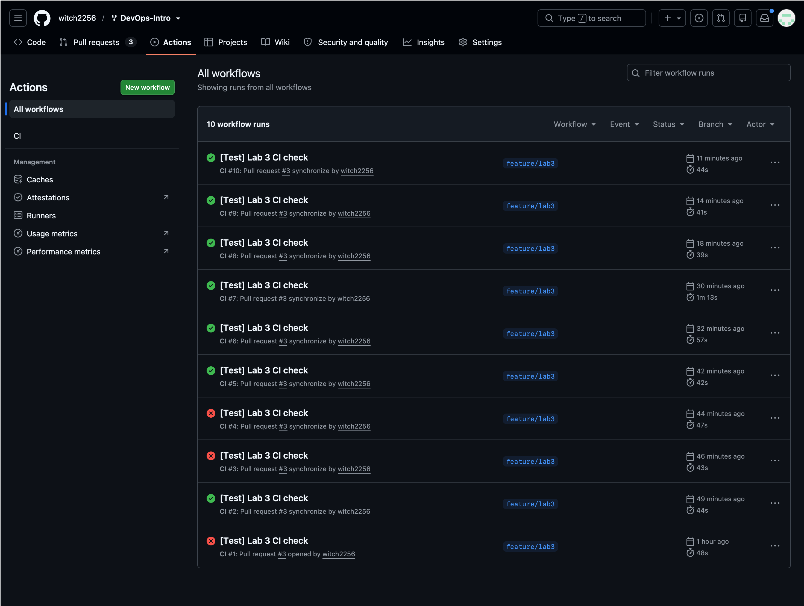
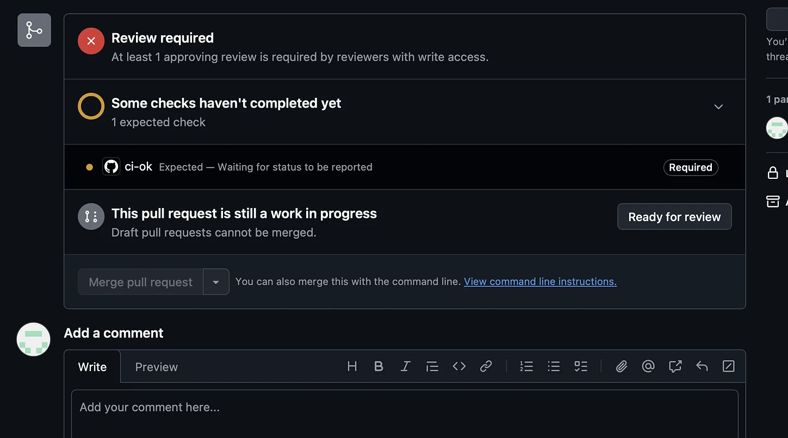
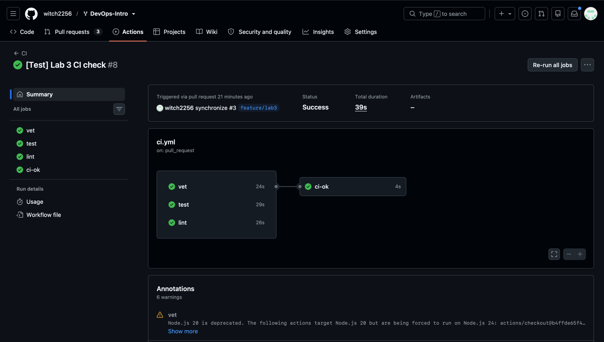
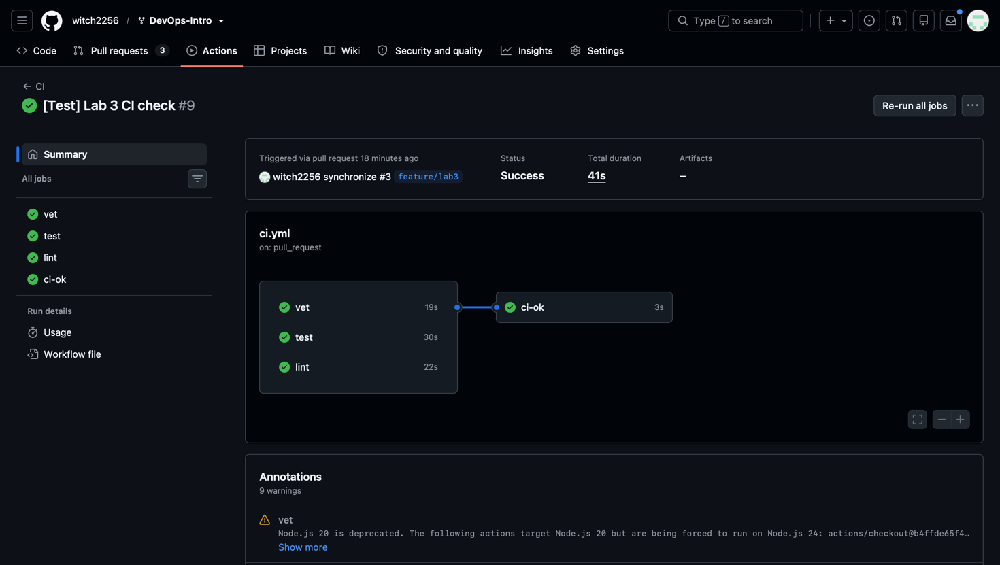
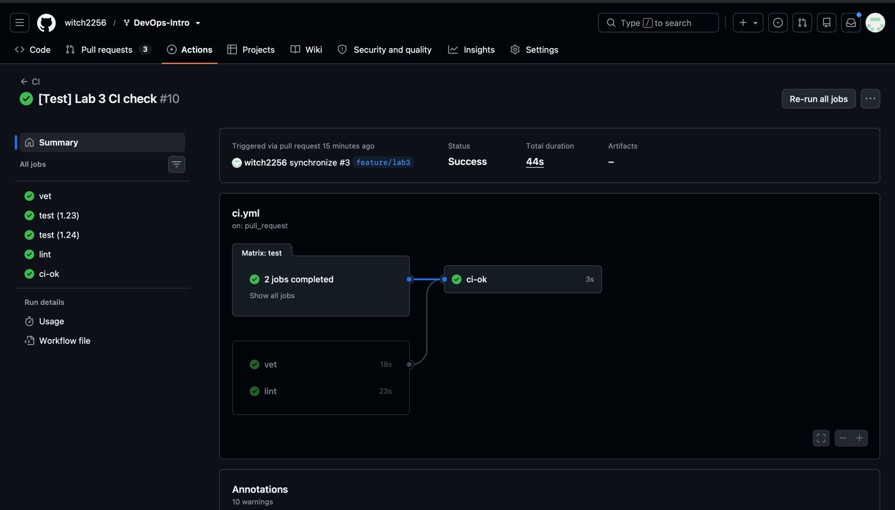

# Lab 3 submission

**Chosen path:** GitHub Actions

## Task 1 — PR Gate

### 1.1 — CI configuration

File: [.github/workflows/ci.yml](../.github/workflows/ci.yml)

Green run: https://github.com/witch2256/DevOps-Intro/actions/runs/35247603172

**Requirements checklist:**
- ✅ Triggers on push to `main` and every PR targeting `main`
- ✅ Three independent jobs: `vet`, `test`, `lint`
- ✅ Pinned runtime: `ubuntu-24.04`, `go-version: '1.24'`, `golangci-lint v2.5.0`
- ✅ All third-party actions pinned by 40-char SHA (checkout, setup-go, golangci-lint-action)
- ✅ `permissions: contents: read` at workflow level
- ✅ Pipeline fails the PR if any of the three jobs fails (via `ci-ok` aggregator)

### 1.5 — Failure + fix demonstration

**Deliberately broken:** changed expected status from `http.StatusBadRequest` to 
`http.StatusOK` in `TestCreateNote_RejectsEmptyTitle`. Run #4 and #5 red 
(both `test (1.23)` and `test (1.24)` failed, `ci-ok` failed).

**Screenshot of failed run:**

**Fix commit:** `e491e29 test(lab3): revert deliberate break — gate verified`

**Green run after fix:** 

### 1.6 — Branch protection

Rule applied to `main`:
- Require a pull request before merging (1 approval)
- Require status checks to pass: **`ci-ok`** (single aggregator)
- Require branches to be up to date before merging
- Require signed commits

**Screenshot:** 

### 1.2 — Design questions

**a) Why pin `ubuntu-24.04` instead of `ubuntu-latest`?**
`ubuntu-latest` is a moving pointer — GitHub flips it to the next LTS 
without warning, which changes glibc, OpenSSL, and system libraries under 
your feet. A commit that was green yesterday can turn red tomorrow due to 
infrastructure, not code. Pinning makes builds reproducible: the same 
commit produces the same result a year from now.

**b) Why split vet / test / lint into separate jobs?**
Parallelism — three independent checks run simultaneously, so wall-clock 
is `max(times)` not `sum(times)`. Plus, if lint fails but test passes, the 
UI shows you exactly which dimension broke; a single combined job would 
fail as a monolith and hide the diagnosis.

**c) What real attack does SHA pinning prevent?**
The **tj-actions/changed-files supply-chain incident (March 2025)**. An 
attacker compromised the maintainer's account and rewrote version tags to 
point at a malicious commit; thousands of repos referencing 
`tj-actions/changed-files@v45` executed code that exfiltrated CI secrets. 
Pinning to a 40-char commit SHA makes the reference immutable — even if the 
tag is rewritten, your workflow still resolves to the original, audited commit.

**d) What is `permissions:`?**
It's the scope of the auto-issued `GITHUB_TOKEN` for each job. GitHub's 
default is broad (write access to repo, issues, packages, etc.). The 
principle is **least privilege**: declare only what you actually need 
(`contents: read` here). If an attacker exploits a vulnerability in a 
pinned action, a narrowly-scoped token limits the blast radius.

**e) N/A** — chose GitHub Actions path.

## Task 2 — Fast and Smart

### 2.1 — Cache
Enabled via `cache: true` on `actions/setup-go` in all three jobs. Keys the 
cache on `go.sum` (deterministic inputs, not build outputs). Effect is 
**minimal** — see timing table below and analysis.

### 2.2 — Matrix
`test` runs against Go **1.23** and **1.24** in parallel (`fail-fast: false`). 
Branch protection requires only `ci-ok`, which aggregates all three jobs, so 
matrix renames (`test` → `test (1.23)` / `test (1.24)`) don't break gating.

### 2.3 — Path filter
`on.push.paths` and `on.pull_request.paths` set to `app/**` and 
`.github/workflows/ci.yml`. Verified by pushing to a branch `test/docs-only` 
with only a `README.md` change — **no CI run was triggered** (7 runs on 
`feature/lab3`, 0 on `test/docs-only`).

**Caveat:** docs-only PRs get stuck on "Expected — Waiting for status to be 
reported" because `ci-ok` is a required check that never runs. Documented as 
a known trade-off; workaround is a no-op workflow that posts a green 
`ci-ok` for filtered paths.

**Semantic note:** GitHub evaluates `pull_request.paths` against the *entire* 
base→head diff, not the last commit. That's why pushes to `feature/lab3` 
(which already contains `ci.yml` in the diff) trigger CI even when only 
`README.md` changed.

### 2.4 — Timing table

| Scenario | Wall-clock |
|---|---|
| Baseline (no cache, no matrix) | 39 s |
| + cache (single Go version) | 41 s |
| + cache + matrix (Go 1.23 + 1.24) | 44 s |

**Analysis:** see the detailed explanation above. QuickNotes has no 
dependencies → module cache is empty → `cache: true` shows no measurable 
improvement (2 s is runner variance). Matrix adds only ~5 s because the two 
test jobs run in parallel. The dominant cost is runner provisioning + 
toolchain download, which `setup-go`'s cache does not touch.

### 2.5 — Design questions

**f) Why cache `go.sum`-keyed inputs and not build outputs?**
Inputs (module checksums) are **deterministic** — same `go.sum` always yields 
the same resolved modules. Outputs (compiled binaries, `.a` archives) can 
differ subtly across machines due to ABI, CGO, compiler patch versions, 
and invisible flags. Caching outputs risks injecting a stale binary built 
in a different environment, producing non-reproducible bugs. Cache the 
recipe, rebuild the dish.

**g) What does `fail-fast: false` change?**
Default `fail-fast: true` cancels all remaining matrix cells as soon as 
one fails — you only see the first error. `false` runs every cell to 
completion so you see the full picture (e.g. "works on 1.24 but broken on 
1.23"). Use `true` when the matrix is huge (20+ cells) and you want to 
save CI minutes on the first failure; use `false` when diagnosing.

**h) Cache poisoning risk from malicious PRs?**
An attacker could submit a PR whose workflow writes poisoned artifacts 
into the cache under a key that a protected branch later reads. GitHub 
mitigates this by **scoping PR caches to the merge ref** — they are not 
readable by the base branch's runs. Additional protections: SHA-pin 
actions (so a compromised action can't write arbitrary cache), don't put 
secrets in caches, and key caches on immutable inputs like `go.sum`. 
Reference: GitHub Actions security hardening guide.

